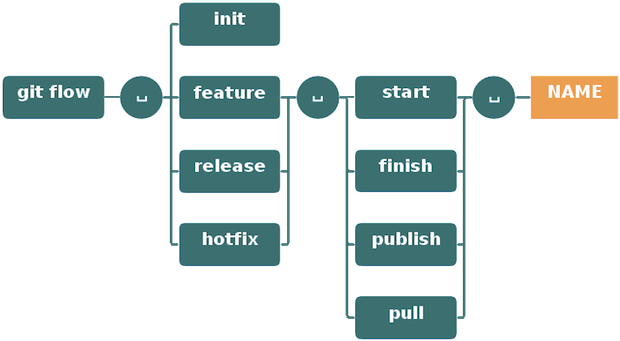

class: center, middle, inverse

# GitFlow Workshop

### by Thomas [@dikalikatao](http://twitter.com/dikalikatao)

---

class: center, middle, inverse

# GitFlow

## Mais qu'est ce que c'est ?


???

---
class: center

# C'est un cadre


???

---
class: center

# Workflow


---
class: center

# Installation


```linux
Linux : apt-get install git-flow 

Mac : brew install git-flow OU port install git-flow
```


???

Bon, pour windows c'est quand même plus compliqué, voici la procédure :
https://github.com/nvie/gitflow/wiki/Windows#github-for-windows

---
class: center

# Commandes




---

# Exemples

```bash
	git flow feature start myNewFeature
 
	*[ ... On code la fonctionnalité
	et on écrit les tests qui vont biens ... ]*

	git commit -am "My new awesome feature !!!!111"

	git flow feature finish myNewFeature
```

---
class: center, middle, inverse


---

class: middle

<div class="michu">

<blockquote>"Ouai c'est bien beau tout ça mais si je veux utiliser facilement GitFlow dans mon projet Maven ?"<br/>
<span style="font-weight: bolder; font-size: 22px;">- Madame Michu, experte maven depuis 1832</span></blockquote>
</div>

# 

---

class: center, middle, inverse


# gitflow-maven-plugin

---

## Ajouter la lib à son projet

### Exemple de config :
```xml
<build>
    <plugins>
        <plugin>
            <groupId>com.amashchenko.maven.plugin</groupId>
            <artifactId>gitflow-maven-plugin</artifactId>
            <version>1.0.8</version>
            <configuration>
                <installProject>false</installProject>
                <verbose>false</verbose>
                <gitFlowConfig>
                    <productionBranch>master</productionBranch>
                    <developmentBranch>develop</developmentBranch>
                    <featureBranchPrefix>feature/</featureBranchPrefix>
                    <releaseBranchPrefix>release/</releaseBranchPrefix>
                    <hotfixBranchPrefix>hotfix/</hotfixBranchPrefix>
                    <supportBranchPrefix>support/</supportBranchPrefix>
                </gitFlowConfig>
            </configuration>
        </plugin>
    </plugins>
</build>
```
---
class: center, middle, inverse

# gitflow-maven-plugin
## Commandes

```xml
mvn gitflow:feature-start
mvn gitflow:feature-finish
mvn gitflow:release-start
mvn gitflow:release-finish
mvn gitflow:hotfix-start
mvn gitflow:hotfix-finish
mvn gitflow:help
```
---
class: center, middle

## 
<div class="michu">

<blockquote>"Moi j'utilise SVN et je voudrais faire pareil !<br/>C'est possible ??"</blockquote>
</div>

???

---
class: center, middle, inverse


???

---
class: center, middle, inverse


